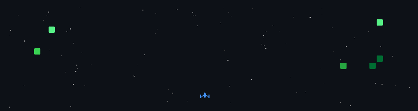

👋 Hi, I'm Abhay Gautam

💡 Passionate about Data Analytics & Backend Development

  

🔗 Connect with me

  
  
  

🛠️ Tech Stack

  
  
  
  
  
  
  

📊 Data Analytics & BI

  
  
  
  
  

🤖 AI/ML & Automation

  
  
  
  

☁️ Cloud & Tools

  
  
  
  
  

<h2 align="center">📊 GitHub Analytics</h2>

  

  

  

<h2>
🏙️ Abhay's Contribution 🏙️
</h2>

  

  

